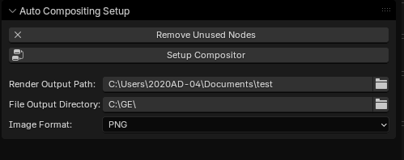
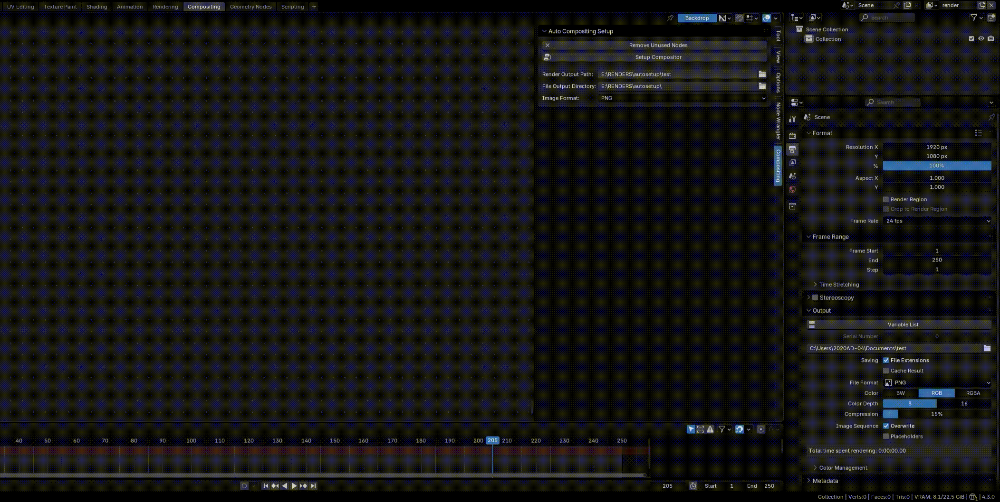

# Auto Compositing layer Setup

<!-- BEGIN LATEST DOWNLOAD BUTTON -->

<!-- END LATEST DOWNLOAD BUTTON -->

## Overview
"Auto Compositing Setup" is a Blender add-on that auto-configures render layer & file output nodes in the Node Editor. It avoids duplicates, sets output paths & formats (PNG, JPEG, etc.), & removes unused nodes. For Blender 4.0.0+, it enhances Compositing workflows with a simple UI.

## Installation
1. Download the script (`auto_compositing_setup.py`).
2. In Blender, go to `Edit > Preferences > Add-ons`.
3. Click `Install`, select the `.py` file, and enable the add-on.

## Usage
1. Open the Node Editor and switch to Compositing mode.
2. In the sidebar (`N` key), find the "Compositing" tab.
3. Use the panel:
   - **Remove Unused Nodes**: Deletes unconnected compositor nodes.
   - **Setup Compositor**: Configures render layers and file outputs.
   - Set **Render Output Path**, **File Output Directory**, and **Image Format**.
4. Adjust settings as needed and render your scene.

   

   

## Features
- Creates render layer nodes per view layer.
- Links the active layer to a composite node; others to file outputs.
- Customizable output paths and formats (PNG, JPEG, OpenEXR, TIFF, TGA).
- Cleans up unused nodes with one click.

## Notes
- Ensure "Use Nodes" is enabled in the Compositing tab.
- Default paths are relative (`//output`, `//x/render_`); adjust as absolute if needed.

